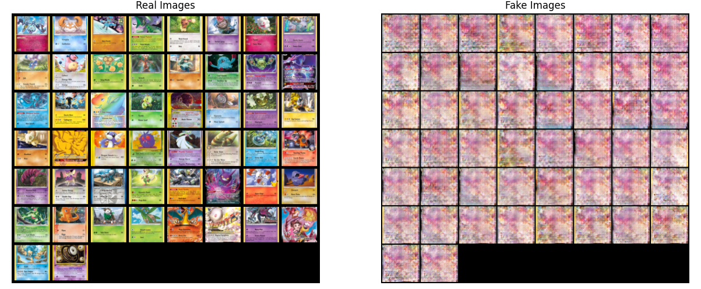
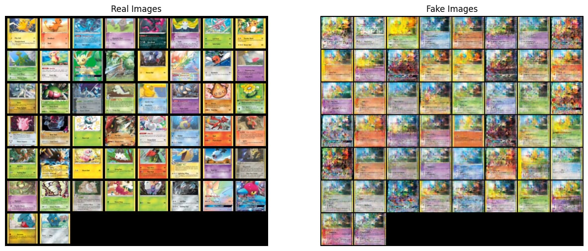

# Generative Adversarial Network

## Main Sections
- [Brief Introduction](#brief-introduction).
- [GAN Introduction](#what-is-gan).
- [My Implementation](#my-implementation).
- [Model Architecture](#model-architecture)
- [Results and Insights](#results)
- [Conclusion](#conclusion)

## Brief Introduction

- This is my mini project to learn about GAN.

## What is GAN?
- It is a type of ***neural network*** that is used to ***generate*** content (images, music, speech ...).

### Motivation
- An adversarial game between two models.
- A **generative model** (G) generates content, then an adversary: a discriminative model (D) tries to guess if the content (whether a real sample or a generated sample) is from a model or the data.
- G gets better by fooling D, and D gets better by catching fakes.

### Adversarial Nets
- Both mentioned models are ***multilayer perceptrons***.
- The training process is pretty straightforward, a minimax algorithm:
	- D: maximize the probability of assigning the correct label to both the training samples from the data and the generated samples from G.
	- In contrast to D, we train G to minimize the likelihood of its content getting "caught".
 - We now have the following equation:
```math
\min _G \max _D V(D, G)=\mathbb{E}_{\boldsymbol{x} \sim p_{\text {data }}(\boldsymbol{x})}[\log D(\boldsymbol{x})]+\mathbb{E}_{\boldsymbol{z} \sim p_{\boldsymbol{z}}(\boldsymbol{z})}[\log (1-D(G(\boldsymbol{z})))]
```
where:

- $`V(D, G)`$ is the **value function** of the adversarial game.  
- $`\mathbb{E}_{\boldsymbol{x}\sim p_{\text{data}}(\boldsymbol{x})}[\;\cdot\;]`$ denotes the **expectation** over real data samples $x$ drawn from the true data distribution $`p_{\text{data}}(x)`$.  
- $`\mathbb{E}_{\boldsymbol{z}\sim p_{\boldsymbol{z}}(\boldsymbol{z})}[\;\cdot\;]`$ denotes the **expectation** over noise vectors $z$ drawn from a simple prior distribution $`p_z(z)`$ (e.g.\ Gaussian or uniform).  
- $`D(\boldsymbol{x})\in(0,1)`$ is the **Discriminator’s** estimated probability that sample $`x`$ is real.  
- $`G(\boldsymbol{z})`$ is the **Generator’s** output (a “fake” sample) when fed noise $`z`$.  
- $`\log D(\boldsymbol{x})`$ encourages $`D`$ to assign high probability to real data.  
- $`\log\bigl(1 - D(G(\boldsymbol{z}))\bigr)`$ encourages $`D`$ to assign low probability to generated (fake) data, and by minimizing this term $`G`$ learns to **fool** $`D`$. 

## My Implementation

- The architecture I will be using is DCGAN, which stands for Deep Convolutional GAN, to try to generate Pokémon Trading Cards.

### Why DCGAN?

- DCGAN improves vanilla GAN by replacing fully connected layers with convolutional layers in the discriminator and transpose-convolutional layers in the generator.
- What that means is that the DCGAN's convolutional filters in the generator learn to capture specific features.

### Framework

- I used [PyTorch](https://docs.pytorch.org/docs/stable/index.html) which is a deep learning framework.

### Dataset

- I took the csv file from the [Pokémon Cards](https://www.kaggle.com/datasets/priyamchoksi/pokemon-cards) dataset on Kaggle.
- I fetched and downloaded the images from the ```image_url``` column.

### Model Architecture

**Generator**: 
```python
class Generator(nn.Module):
    def __init__(self):
        super().__init__()
        self.model = nn.Sequential(
            # Input: Z → (LATENT_VECTOR_SIZE, 1, 1)
            nn.ConvTranspose2d(LATENT_VECTOR_SIZE, NUM_FEATURES * 8, kernel_size=4, stride=2, padding=0),
            nn.BatchNorm2d(NUM_FEATURES * 8), nn.ReLU(inplace=True),  # → (NUM_FEATURES*8, 4, 4)
            nn.ConvTranspose2d(NUM_FEATURES * 8, NUM_FEATURES * 4, kernel_size=4, stride=2, padding=1),
            nn.BatchNorm2d(NUM_FEATURES * 4), nn.ReLU(inplace=True),  # → (NUM_FEATURES*4, 8, 8)
            nn.ConvTranspose2d(NUM_FEATURES * 4, NUM_FEATURES * 2, kernel_size=4, stride=2, padding=1),
            nn.BatchNorm2d(NUM_FEATURES * 2), nn.ReLU(inplace=True),  # → (NUM_FEATURES*2, 16, 16)
            nn.ConvTranspose2d(NUM_FEATURES * 2, NUM_FEATURES, kernel_size=4, stride=2, padding=1),
            nn.BatchNorm2d(NUM_FEATURES), nn.ReLU(inplace=True),       # → (NUM_FEATURES, 32, 32)
            nn.ConvTranspose2d(NUM_FEATURES, NUM_CHANELS, kernel_size=4, stride=2, padding=1),
            nn.Tanh()                                                 # → (3, 64, 64)
        )
```
- Input: a random [latent vector](https://viblo.asia/p/tim-hieu-ve-latent-space-LzD5dvaOZjY).
- Output: a 3-channel 64×64 RGB image.

**Discriminator**
```python
class Discriminator(nn.Module):
    def __init__(self):
        super().__init__()
        self.model = nn.Sequential(
            # Input: 3×64×64 image
            nn.Conv2d(3, NUM_FEATURES, kernel_size=4, stride=2, padding=1),
            nn.BatchNorm2d(NUM_FEATURES), nn.LeakyReLU(0.2),  # → (NUM_FEATURES, 32, 32)
            nn.Conv2d(NUM_FEATURES, NUM_FEATURES*2, kernel_size=4, stride=2, padding=1),
            nn.BatchNorm2d(NUM_FEATURES*2), nn.LeakyReLU(0.2),# → (NUM_FEATURES*2, 16, 16)
            nn.Conv2d(NUM_FEATURES*2, NUM_FEATURES*4, kernel_size=4, stride=2, padding=1),
            nn.BatchNorm2d(NUM_FEATURES*4), nn.LeakyReLU(0.2),# → (NUM_FEATURES*4, 8, 8)
            nn.Conv2d(NUM_FEATURES*4, NUM_FEATURES*8, kernel_size=4, stride=2, padding=1),
            nn.BatchNorm2d(NUM_FEATURES*8), nn.LeakyReLU(0.2),# → (NUM_FEATURES*8, 4, 4)
            nn.Conv2d(NUM_FEATURES*8, 1, kernel_size=4, stride=2, padding=0),
            nn.Sigmoid()                                       # → (1, 1, 1)
        )
```
- Input: a 3-channel 64×64 RGB image.
- Output: a scalar probability of "realness".

### Results

#### Training with 12k images

Trained for 200 epochs and achieved the [Saturation Problem](https://stackoverflow.com/questions/59810302/gan-failure-to-converge-with-both-discriminator-and-generator-loss-go-to-0) after 11 epochs out of 200.

**Log:**
```
[11/200][168/262] Loss_D: 2.0430  Loss_G: 10.2914  D(x): 0.7010  D(G(z)): 0.0000 / 0.0713
[11/200][170/262] Loss_D: 3.7319  Loss_G: 0.0000   D(x): 0.5911  D(G(z)): 1.0000 / 1.0000
[11/200][172/262] Loss_D: 100.0000 Loss_G: 0.0000   D(x): 1.0000  D(G(z)): 1.0000 / 1.0000
[11/200][174/262] Loss_D: 100.0000 Loss_G: 0.0000   D(x): 1.0000  D(G(z)): 1.0000 / 1.0000
```

- As we can see, the generator has become so "smart" that the discriminator cannot catch up, which indicates that the generator is overpowering the discriminator and leading to vanishing gradients.
- Possible fixes:
    - Lowering the generator learning rate.
    - Boosting the power of the discriminator (adding more layers?).
    - Continuing training (*worst choice*).

**Result:**


Insight:
- Color distributions in fake samples broadly match the colors of real cards $\rightarrow$ the model is learning the style.
- The details and texture remain blurry, do not show any sign of improvement.

#### Training with 2k images

Trained for 15 epochs.

**Log:**
```
[14/200][236/262] Loss_D: 0.0212  Loss_G: 5.4926  D(x): 0.9944  D(G(z)): 0.0152 / 0.0081
[14/200][238/262] Loss_D: 0.0611  Loss_G: 6.1382  D(x): 0.9873  D(G(z)): 0.0425 / 0.0043
[14/200][240/262] Loss_D: 0.0096  Loss_G: 6.2776  D(x): 0.9969  D(G(z)): 0.0065 / 0.0043
[14/200][242/262] Loss_D: 0.0967  Loss_G: 4.0573  D(x): 0.9409  D(G(z)): 0.0273 / 0.0297
```

- Loss_D remains low, indicating the discriminator can easily distinguish real from fake.
- Loss_G is high, indicating the generator's struggle to produce convincing images.
- [Data Scarcity Effects](https://deepgram.com/ai-glossary/data-scarcity): with only 2,000 images, the discriminator learns faster and risks overfitting, making it harder for the generator to improve.
- Possible improvements:
    - Using data augmentation to expand variety.
    - Applying regularization techniques.

**Result:**


Insight:
- Same as training with 12k images, the color palette matches between the real and fake images.
- We can actually see some kind of signs that the fake images are getting "more real".

## Conclusion

- Training DCGANs on Pokémon Trading Cards revealed the critical interplay between dataset size and adversarial balance. With 12,000 images, the discriminator quickly saturated—an example of discriminator saturation—stalling the generator by providing no useful gradients. Conversely, with only 2,000 images, the discriminator maintained a strong but non-saturated advantage, resulting in high generator losses and persistent artifacts.
